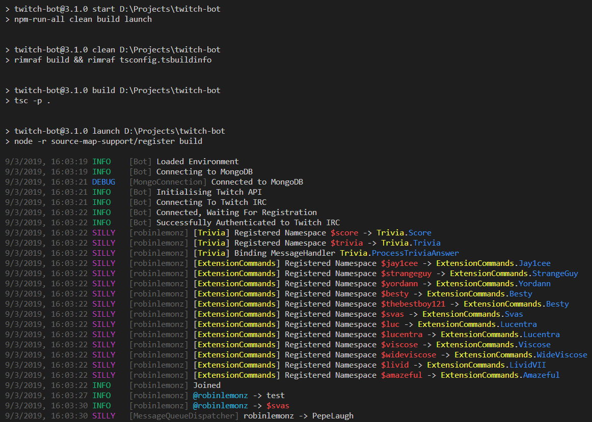

<p align="center">
  <h3 align="center">Twitch Bot</h3>
  <p align="center">A TypeScript driven automated Twitch client that provides functionality in streamers chats.</p>

  <p align="center">
    <a href="https://travis-ci.com/Robinlemon/twitch-bot"></a>
    <a href="https://david-dm.org/Robinlemon/twitch-bot"></a>
    <a href="https://david-dm.org/Robinlemon/twitch-bot?type=dev"></a>
    <a href="https://coveralls.io/github/Robinlemon/twitch-bot?branch=master"></a>
    <a href="https://codechecks.io"></a>
  </p>
  
  <p align="center">
    
  </p>
</p>

## Tests

To run the test suite, first install the dependencies, then run `npm test`:

```bash
$ npm install
$ npm test
```

## License

[MIT](LICENSE)
